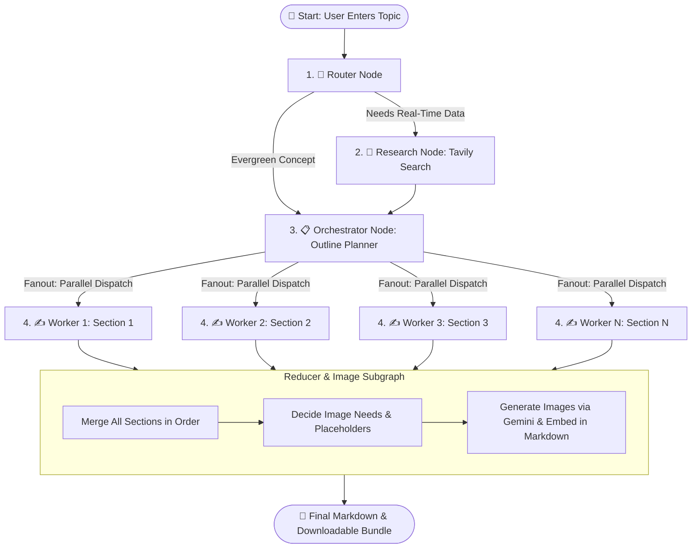

# ✍️ Autonomous Blog Generator Agent (BWA)

An end-to-end, multi-agent AI system built with **LangGraph**, **LangChain**, and **Streamlit** that autonomously researches, plans, writes, illustrates, and bundles publication-ready technical blog posts.

---

## 🌟 Overview: What is this Project?

Imagine having an entire digital publishing team working for you in seconds:
- 🕵️‍♂️ A **Researcher** who scours the web for up-to-date facts, benchmarks, and news.
- 📐 An **Architect / Outline Planner** who structures the blog into logically sequenced sections with clear goals and target word counts.
- ✍️ A **Writing Team** that writes each section simultaneously in parallel.
- 🎨 An **Art Director & Illustrator** that identifies where diagrams or visual aids are needed, generates custom illustrations, and embeds them directly into your article.
- 📦 A **Publisher** that compiles everything into a clean Markdown file and a downloadable ZIP bundle with all generated images.

This project implements this entire workflow as a stateful, cyclic multi-agent graph powered by **LangGraph**.

---

## 🚀 Key Features

- **Intelligent Routing**: Determines if a topic is *closed-book* (evergreen theory), *hybrid* (concepts + recent tools), or *open-book* (breaking news, recent releases).
- **Date-Aware Web Research**: Uses **Tavily Search API** with strict date filters and source deduplication to ground claims in real evidence.
- **Parallel Content Generation (Fanout)**: Leverages LangGraph's dynamic `Send()` API to write multiple blog sections concurrently.
- **AI Diagram & Image Generation**: Uses Google's **Gemini Image Generation** (`gemini-2.5-flash-image`) to automatically design and place contextual technical diagrams.
- **Dual Engine Support**:
  - ☁️ **Cloud Mode**: Fast, high-capacity generation via **Google Gemini** (`gemini-2.5-flash`).
  - 💻 **Local Mode**: Privacy-focused, local execution via **Ollama** (e.g., `qwen2.5:3b`).
- **Interactive Streamlit UI**:
  - Live progress monitoring through graph nodes.
  - Interactive tabs: **Plan**, **Evidence**, **Markdown Preview**, **Images**, and **Logs**.
  - One-click downloads for Markdown (`.md`) and complete ZIP bundles (`.zip`).
  - History viewer to reload and review previously generated blogs.

---

## 🧠 How It Works (In Simple Words)

The entire generation pipeline is organized as a **LangGraph State Graph**:



### 1. 🧭 The Router (`router_node`)
When you submit a topic (e.g., *"Latest developments in quantum computing"* vs. *"How does binary search work"*), the router evaluates whether the topic requires real-time web research:
- **`closed_book`**: Core, timeless concepts (no web search needed).
- **`hybrid`**: Evergreen topics needing modern examples (searches recent 45 days).
- **`open_book`**: Fast-moving news, policy, or pricing (searches the past 7 days).

### 2. 🔎 The Researcher (`research_node`)
If research is needed, the agent generates targeted search queries, calls the **Tavily Search API**, collects snippets, filters out outdated articles based on your selected "As-of date", and packages the findings as verified evidence.

### 3. 📋 The Orchestrator (`orchestrator_node`)
The orchestrator acts as the lead editor. It reviews the topic and any gathered evidence to produce a comprehensive **Plan**:
- Blog title, target audience, tone, and blog type (`explainer`, `tutorial`, `news_roundup`, etc.).
- A list of structured sections (tasks), each with a specific goal, bullet points, target word count, and flags (e.g., `requires_code`, `requires_citations`).

### 4. ✍️ The Parallel Workers (`worker_node`)
Instead of writing the whole article from top to bottom (which is slow and often loses focus), the agent uses **LangGraph Fanout (`Send`)** to spawn individual worker agents for each section simultaneously:
- Each worker focuses exclusively on its assigned section.
- Workers adhere strictly to word limits, bullet points, code requirements, and citations from the evidence pack.

### 5. 🎨 The Reducer & Illustrator (`reducer_subgraph`)
Once all sections are completed, the Reducer subgraph takes over:
- **Merge (`merge_content`)**: Combines sections in their correct numerical order into one cohesive article.
- **Decide Images (`decide_images`)**: Evaluates the text and decides if technical diagrams, flowcharts, or visuals would materially help the reader (up to 3 images max). It places placeholders like `[[IMAGE_1]]` into the text and formulates descriptive generation prompts.
- **Generate & Place Images (`generate_and_place_images`)**: Calls Google's Gemini image model, saves images to the `images/` directory, and replaces the placeholders with standard Markdown image links.

### 6. 🖥️ Interactive Web UI (`bwa_frontend.py`)
Streamlit streams the entire process in real time, letting you inspect the outline, examine sources, preview the final post with inline images, and download the finished package.


---

## 📁 Project Structure

```text
Blog Generator Agent/
│
├── bwa_frontend.py      # Streamlit web application & user interface
├── bwa_backend.py       # LangGraph backend using Google Gemini (Cloud LLM)
├── local_model.py       # LangGraph backend using Ollama (Local LLM)
├── requirements.txt     # Project Python dependencies
├── .env                 # API keys and environment variables (ignored by Git)
├── .gitignore           # Git ignore rules
│
├── images/              # (Auto-created) Stores generated blog images & diagrams
└── *.md                 # (Auto-created) Generated blog posts saved as Markdown
```

---

## 🛠️ Installation & Setup

### 1. Prerequisites
- **Python 3.10+** installed on your system.
- An API key for **Google Gemini** (Get one at [Google AI Studio](https://aistudio.google.com/)).
- *(Optional)* An API key for **Tavily** for web search capabilities (Get one at [Tavily AI](https://tavily.com/)).
- *(Optional for Local Mode)* **Ollama** installed locally (Download from [ollama.ai](https://ollama.ai/)).

### 2. Clone or Navigate to the Project
```bash
cd "d:/Projects/Blog Generator Agent"
```

### 3. Create and Activate a Virtual Environment
```bash
# Windows (PowerShell)
python -m venv venv
.\venv\Scripts\Activate.ps1

# Windows (Command Prompt)
python -m venv venv
.\venv\Scripts\activate.bat

# Linux / macOS
python3 -m venv venv
source venv/bin/activate
```

### 4. Install Dependencies
```bash
pip install -r requirements.txt
```

### 5. Configure Environment Variables
Create or edit your `.env` file in the root directory:
```ini
# Google Gemini API key (used for Gemini LLM and Image Generation)
GEMINI_API_KEY=your_google_gemini_api_key_here
GOOGLE_API_KEY=your_google_gemini_api_key_here

# Tavily API key (used for automated web research)
TAVILY_API_KEY=your_tavily_api_key_here
```

---

## 🚀 How to Run the Application

### Option A: Running with Google Gemini (Cloud Model)
1. In `bwa_frontend.py`, ensure the backend import points to `bwa_backend`:
   ```python
   from bwa_backend import app
   # from local_model import app
   ```
2. Run the Streamlit app:
   ```bash
   streamlit run bwa_frontend.py
   ```

### Option B: Running with Ollama (Local Model)
1. Make sure Ollama is running and pull your preferred model (default is `qwen2.5:3b`):
   ```bash
   ollama run qwen2.5:3b
   ```
2. In `bwa_frontend.py`, ensure the backend import points to `local_model`:
   ```python
   # from bwa_backend import app
   from local_model import app
   ```
3. Run the Streamlit app:
   ```bash
   streamlit run bwa_frontend.py
   ```

---

## 🖥️ Using the Streamlit Interface

1. **Enter Topic**: Type your subject into the sidebar (e.g., *"A deep dive into Attention Mechanism in Transformers with Python code"*).
2. **Select As-Of Date**: Set the reference date for recency-sensitive searches.
3. **Click "🚀 Generate Blog"**:
   - Watch the agent move across nodes (`router` ➡️ `research` ➡️ `orchestrator` ➡️ `worker` ➡️ `reducer`).
4. **Explore the Results**:
   - **🧩 Plan**: View the target audience, tone, and full section-by-section breakdown.
   - **🔎 Evidence**: Inspect every web source gathered, with clickable URLs and publish dates.
   - **📝 Markdown Preview**: Read the full article with formatted headings, code blocks, and rendered diagrams.
   - **🖼️ Images**: See the generated diagrams along with their prompts and download an `images.zip`.
   - **🧾 Logs**: View the raw JSON states and event stream.
5. **Download**:
   - Click **⬇️ Download Markdown** for just the `.md` file.
   - Click **📦 Download Bundle (MD + images)** for a complete `.zip` archive.
6. **Past Blogs**: Re-load and preview previously generated articles anytime from the sidebar list.

---

## ⚙️ Configuration & Customization

| Setting | File | Description |
| :--- | :--- | :--- |
| **LLM Model** | `bwa_backend.py` / `local_model.py` | Change `gemini-2.5-flash` or Ollama model (`qwen2.5:3b`, `llama3.2`, etc.) |
| **Image Model** | `_gemini_generate_image_bytes()` | Configured to `gemini-2.5-flash-image` |
| **Max Images** | `DECIDE_IMAGES_SYSTEM` | Default is maximum 3 technical diagrams per article |
| **Search Depth** | `_tavily_search()` | Adjust `max_results` per query |

---

## ❓ Troubleshooting

- **Image Generation Fails / Quota Exceeded**:
  - Verify that `GOOGLE_API_KEY` is set in `.env`. If image generation fails or hits a quota, the pipeline gracefully falls back to inserting a descriptive prompt block into the markdown so your document is never lost.
- **Ollama Connection Error (Local Mode)**:
  - Make sure the Ollama daemon is running (`ollama serve`) and the model specified in `local_model.py` has been pulled (`ollama pull qwen2.5:3b`).
- **No Evidence Found**:
  - If your topic is evergreen (e.g., *"What is Dijkstra's Algorithm"*), the router deliberately skips web search to save time and API calls. If you want research, mention recent terms (e.g., *"Latest benchmarks 2025"*).

---

## 📜 License
This project is open-source and available under the [MIT License](LICENSE).


